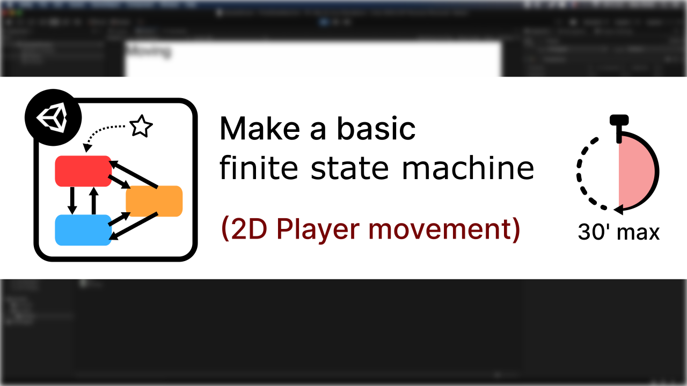
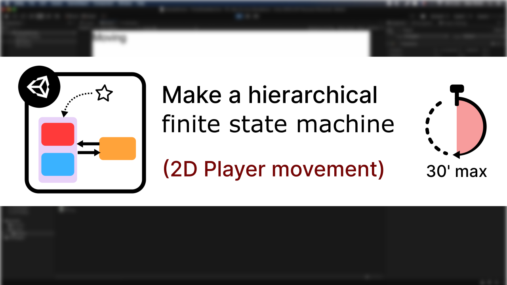
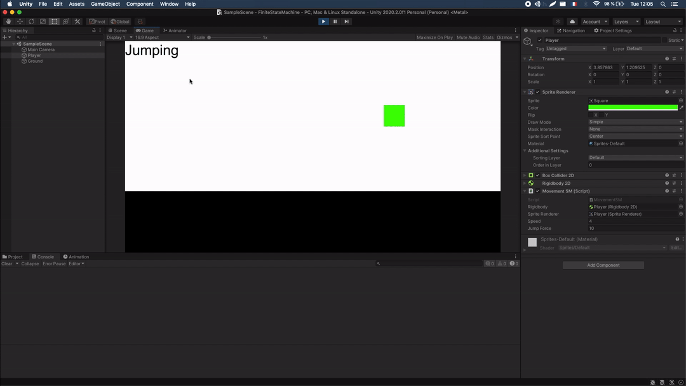

# [Unity/C#] Finite State Machines

We can model entity behaviour via state machines, what are the benefits and the
costs of implementing one and how hierarchical state machines can help you share logic without repeating code. The series
uses 2D physics-based player movement (with rigidbodies) as a direct application example.

This Github repo contains the code that is written throughout those tutorials:

- the parent virtual classes that define state machines and their inherent states
- the actual instantiable classes derived from those for our specific 2D-movement state machine

